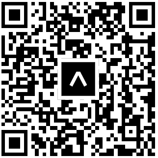

# Upgo

    

## Objectif du Projet 🎯

Ce projet a pour but de voir les dates de sorties des prochaines paires 😯✨, à travers une application mobile bien sûr, simple à l'usage.

Objectifs Personnels :

-   Coder un MVP en 1 semaine.
-   Avoir une application qui reste optimisée malgré la quantité des données.

## Stratégie UX 📑

### Objectifs de l'application mobile 📴

-   Avoir un design épuré.
-   Utiliser des couleurs à la mode et facilement différenciable (afin de réduire les besoins de concentrations).

### Besoin Utilisateur 👨

La principale cible de cette application est composée majoritairement de jeunes. Les besoins que nous avons relevé sont les suivants :

-   Améliorer l'expérience des utilisateurs dans la raffle de sneakers en ligne.
-   Voir les futures sorties de sneakers de la marketplace StockX.
-   Savoir quels sont les chaussures tendance du moment.

### Fonctionnalités présentes 👍

1. Recherche des sneakers par :
    - Marque
    - Nom
    - Catégorie
    - Date de sortie
    - Sexe
2. Application de filtres aux recherches effectuées.
3. Calendrier pour visualiser les chaussures de façon chronologique.
4. Vue sur les chaussures les plus récentes.
5. Vue sur la chaussure la plus achetée.
6. Stockage des favoris coté client.
7. Page détail pour chaque chaussure avec :
    - Description des la chaussure concernée
    - Vue des différents `tags`
    - Vue sur les différents utilisateurs ayant liké ou acheter la chaussure
    - Vue sur la réduction du prix
8. Scroll infini pour une exploration libre du l'utilisateur.

### Fonctionnalités à ajouter :bulb:

1. Stockage des données utilisateurs en backend.
2. Transformation des images `.jpg` reçues en `.png` avec un fond transparent.
3. Mode hors connexion.

## Technologies Utilisées :man_technologist:

-   [React Native](https://reactnative.dev/) : pour programmer l'application cross-platform.
-   [Postman](https://www.postman.com/) : pour exécuter les appels HTTP directement depuis un interface graphique et visualiser le résultat de façon présentable.
-   [Expo CLI](https://expo.dev/) : pour publier l'application.
-   [VSCode](https://code.visualstudio.com) : mon éditeur de code en développement web.

## Déploiement 🚀

L'application est publié en ligne et peut être visualisé en installant l'application `ExpoGo` sur votre smartphone et en ouvrant le lien suivant : [UpGo](https://expo.dev/@willyndefo/Upgo)

**OU ENCORE**

En scannant mon QR code :

    

## Crédits 🌟

### Contenu

Toutes les données utilisées par cette application proviennent de l'api de [StockX](https://stockx.com/api/).

### Remerciements

Grand merci à mes amis qui m'ont aidés pour les tests et les critiques visuelles lors du développement de l'application.
